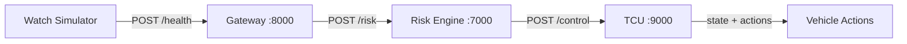

# `Health-Car System`

A small, event‑driven prototype that simulates a wearable device streaming heart‑rate data to a vehicle. The system computes risk from the incoming BPM stream and drives a vehicle safety state machine (warning → alert → pull‑over).

## High‑Level Flow



## Components

- **watchSimulation.py** – Sends BPM + ACK signals to the gateway using scripted scenarios.
- **gateway.py** – Ingests health events and forwards them to the risk engine.
- **riskEngine.py** – Maintains a sliding window of BPM values and computes a risk score.
- **tcu.py** – Safety controller FSM that maps risk + driver acknowledgment to actions.
- **common.py** – Shared constants (URLs, thresholds, timing).

## Data Contract (simplified)

```json
{
  "driver_id": "DRV001",
  "bpm": 150,
  "ack": false,
  "ts": 1710000000.0
}
```

- **bpm**: current heart‑rate reading
- **ack**: driver acknowledged the warning (button press / prompt)

## Use Case (What This Simulates)

A driver wears a watch that continuously streams heart rate. The car monitors the trend, detects risk (sustained high BPM, instability, spikes), and escalates safety actions:

1. **Normal → Warning**: rising risk triggers soft alerts.
2. **Warning → Alert**: persistent risk escalates to loud alarm + speed reduction.
3. **Alert → Pull‑Over**: critical risk forces hazard + braking to a safe stop.

## Example Run (Sustained High BPM)

1. Start services in separate terminals:

   - Gateway
     ```bash
     uvicorn gateway:app --host 0.0.0.0 --port 8000
     ```
   - Risk Engine
     ```bash
     uvicorn riskEngine:app --host 0.0.0.0 --port 7000
     ```
   - TCU
     ```bash
     uvicorn tcu:app --host 0.0.0.0 --port 9000
     ```

2. Run the watch simulator:

```bash
python watchSimulation.py --scenario S3
```

**Expected behavior**: BPM stays high, risk increases, and the TCU transitions through WARNING → ALERT → PULL_OVER → STOPPED while reducing speed.

## Scenarios

```bash
python watchSimulation.py --list
```

- **S1** NORMAL
- **S2** SPIKE
- **S3** SUSTAINED_HIGH
- **S4** RECOVERY_ACK
- **S5** CRITICAL
- **S6** FLAPPING

## Configuration

Thresholds and timing are in **common.py**:

- `WARN_LEVEL`, `ALERT_LEVEL`, `CRITICAL_LEVEL`
- `WINDOW_SIZE`, `SEND_INTERVAL`
- Service URLs (`GATEWAY_URL`, `RISK_URL`, `TCU_URL`)

## Minimal Curl Example

```bash
curl -X POST http://localhost:8000/health \
  -H "Content-Type: application/json" \
  -d '{"driver_id":"DRV001","bpm":160,"ack":false,"ts":1710000000.0}'
```

This single event will be buffered by the risk engine until the sliding window is full, then a risk score is computed and forwarded to the TCU.
